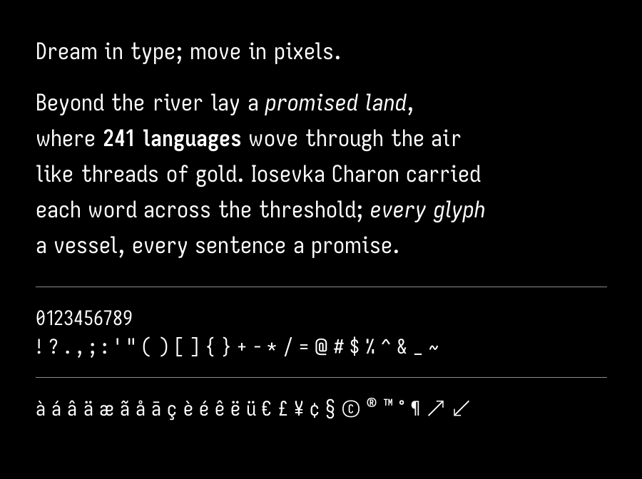
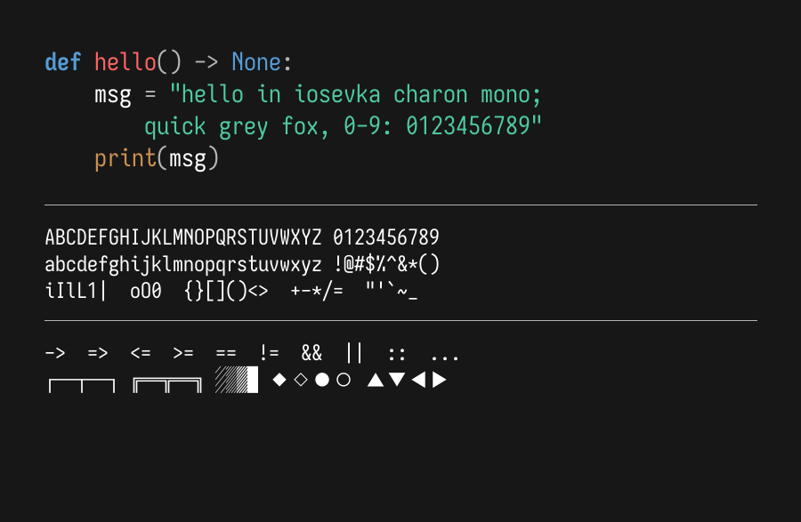

# Iosevka Charon

Iosevka Charon is a quasi-proportional font excellent for technical writing and dense UI. Iosevka Charon Mono is a true monospace font tuned for coding and terminal use. This repository builds each family from scratch and publishes TTFs with every release. Its unique contribution is that it takes the upstream [Iosevka](https://github.com/be5invis/Iosevka) source code by **Belleve Invis** and builds it in a way that makes the resulting fonts Google Fonts compliant.

## Building and testing

Clone via `git clone --depth 10 --branch main https://github.com/jul-sh/iosevka-charon.git` to avoid downloading the entire upstream history.

The Make targets rely on the Nix flake dev shell, which not only bootstraps the Python venv but also supplies the native toolchain required to build the fonts (e.g., Node, ttfautohint, and Git). If Nix is installed, `make` automatically enters the flake dev shell; when Nix is absent but Docker is available, the same flow runs inside the official `nixos/nix` container. With either tool installed, you can rely solely on the standard GNU Make entry points:

- `make build` – enter the Nix shell, build the fonts.
- `make test` – validate built fonts for Google Font compliance.
- see the Makefile for more details.

## Tooling

- Nix flake in `flake.nix` (root) provisions Node, Python with all font processing packages, native build tools (like ttfautohint), and other supporting dependencies.
- `sources/iosevka` is a git subtree containing the upstream Iosevka sources and Iosveka Charon build plan.
- `scripts/` contains scripts for building, and post processing to achieve Google Fonts compliance.

## Repository layout

- `sources/` – Iosevka subtree, build plans → `general_use_fonts/`
- `scripts/` – build script and google fronts post-processing script that transform `general_use_fonts/` → `fonts/`
- `general_use_fonts/` – General Use TTFs created by `make build` (gitignored)
- `fonts/` – Google Fonts TTFs created by `make build` (gitignored)
- `out/` – QA reports and proofs from `make test` / `make proof` (gitignored)
- `documentation/` – specimen assets (from the Google Fonts template)
- `flake.nix` – Nix development environment configuration

## License

SIL Open Font License 1.1 (see `OFL.txt`).
